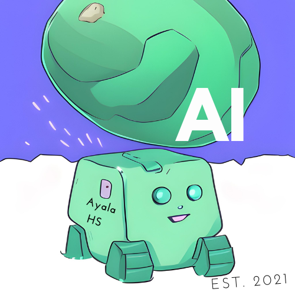

# [Ayala AI Club](https://github.com/ohhh25/ai-club)

Teaching AI to high-schoolers in a high-schooler friendly format! 
Meetings: Every Monday 3:30PM in H114 
Remind: @aiclub2023 
Instagram: [https://www.instagram.com/ayala_aiclub/](https://www.instagram.com/ayala_aiclub/) 

## 2024 Spring AI Project: TBD
AI Project Voting Link (use school email to access): [https://forms.gle/aNuoDY9ScRgTPJcHA](https://forms.gle/aNuoDY9ScRgTPJcHA) 

Possible Project Ideas:
- Computer Vision
  - AI Art
  - Object Detection
  - Autonomous Vehicles (Object Detection AND Tracking)
  - Tello Drone
- Natural Language Processing (mini Chat-GPT chatbot)
- Audio Processing
  - AI songs
  - AI voice (voice changers, personal voice cloning/mimicking, generating AI voices, etc.)
  - Real-time transcription/translation
- Audio + Natural Language Processing (human ask question, AI chatbot talks back)
- AI in Healthcare/Biomedicine
